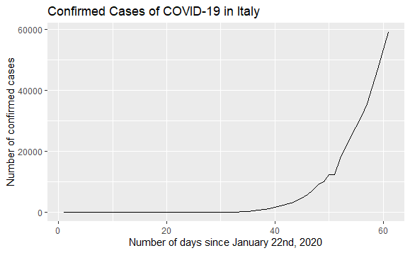

# Investigating the Coronavirus Pandemic
## A codecademy Project

**Objective:** Examine data associated with the Coronavirus pandemic from 2020. Use R to filter the data, group by country, and visualize some trends. 

Programming languages and libraries used: 
- R
- dplyr
- readr
- janitor
- ggplot2

Click this [link](https://jdg0711.github.io/analyzing_cororavirus_data/Coronavirus_Starting.html) to view the RStudio notebook rendered as a webpage.

